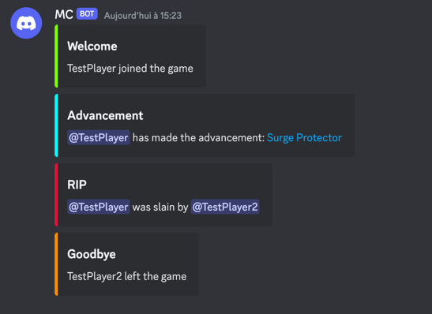

# McSoLogs

> Simple minecraft log parser that send discord notification when specific event occurs.

The following event are monitored:
- Advancement
- Death
- Player logging in
- PLayer logging out


```
Usage of mcsologs:
  -c, --config string     Config file containing the webhook url
      --debug             Re-read the current file (used for debugging purpose)
  -f, --log-file string   Log File to monitor
```

## Exemple of sent notification:
